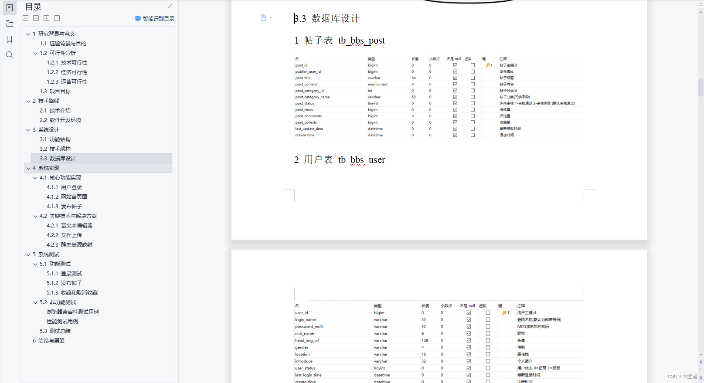

# 1 项目介绍
基于SSM的论坛网站：后端 SpringBoot、Mybatis，前端thymeleaf，具体功能如下：
- 基本功能：登录注册、修改个人信息、修改密码、修改头像
- 查看帖子列表：按热度排序、按更新时间排序、查看周榜月榜
- 查看帖子详情：收藏/取消收藏、发布评论
- 发布帖子：富文本编辑器发布帖子
- 我的主页：查看我最近(30天)发布的帖子、查看我最近(30天)发布的评论
- 用户中心：编辑帖子、删除帖子、查看收藏
# 2 系统运行截图
## 2.1 网站首页

## 2.2 帖子详情

## 2.3 发布帖子

## 2.4 我的主页

## 2.5 用户中心

## 2.6 基本设置

## 2.7 登录注册

# 3 数据库设计

# 4 系统文档

# 5 源码数据库获取(收费)

